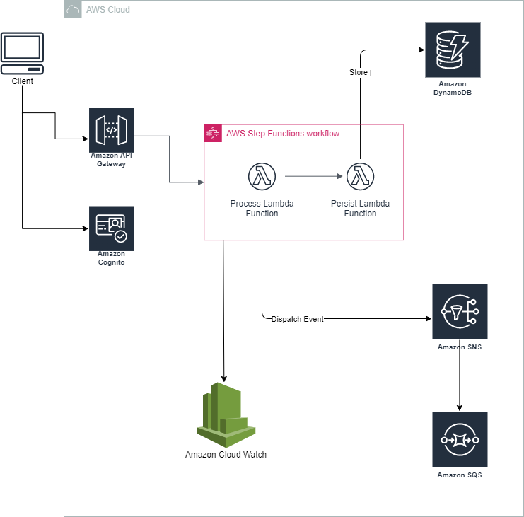
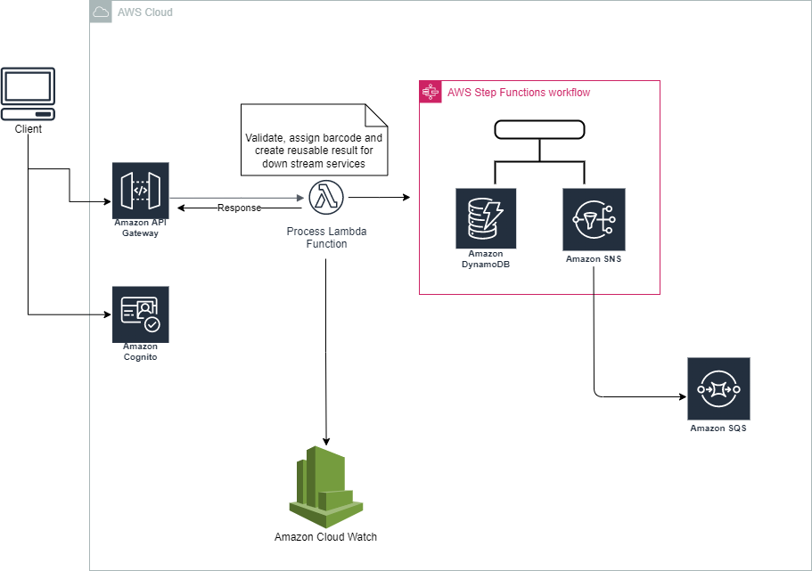

# Parcel PreAnnouncement Service

The service includes REST endpoint which lets customers pre-register their parcels with Post Service Provider and receive an electronic receipt that includes the corresponding Barcode.
The endpoint accepts a set of parcels information at a time, which make it easy for consumers to either use it in a per parcel basis or in a batch processing mode.
You can find project requirement in more details at [Requirements](docs/Pre-AnnouncementLabelSample.pdf). In this document, you will find instructions, decisions, and relevant technical details regarding how the codebase is developed.

<br/>

## Architecture
The architecture is mainly based on Serverless architecture implemented by AWS Serverless infrastructure.

You can find a brief architectural view of the application below; This diagram describes how different components of the system have been arranged and interact with each other

<br/>



<br/>

# Components
You can find a brief list of components that have been used for different aspects of managing a pre-announcement request below: 

**Api Gateway** To provide an application interface

**Step Function** To make orchestration across different processing units

**Lambda** To encapsulate processing logic using C# implementation

**Cognito** To provide integrated authentication for exposed API

**CloudWatch** To centralize application logging and tracing data

**DynamoDB** To persist pre-announcement requests for reporting purposes

<br/>

# Application Interface

Pre-announcement service exposes a main entry point for clients to pass through their parcel information and create their processing requests. This endpoint receives a list of PreAnnouncement requests which makes it suitable for both per-parcel basic and batch-processing.

The client also needs to call `Cognito` client app to authenticate itself and use the `Authentication Token` to proceed with calling the target API.

The below section describes a sample payload that could be sent through the endpoint

```
  [{"SenderAddress": {      
		    "PostalCode": "2595AK",
        "City": "Den Haag",
        "AddressLine": "Prinses Beatrixlaan",
        "Number": 23,
        "NumberAddition": ""},
     "SenderName": "PostNL",
     "RecipientAddress" : {      
		    "PostalCode": "3532VA",
        "City": "Utrecht",
        "AddressLine": "Bilderdijkstraat",
        "Number": 9,
        "NumberAddition": ""},
     "RecipientName": "Peter de Ruiter",
     "DispatchingService": "Pakket- en Briefautomaat"
	 }]
```


# Further Development

The initial implemented design is made out of the assumed requirement of the service and could have some drawbacks when the system requirement gets more complicated.
Because of that, there is a proposal to have a more granular and flexible design that could be implemented in future versions



<br/>
<br/>

## Disclaimer
Because of time constraints, some aspects of the assignment were not implemented for a production-ready deployment and would just demonstrate my design idea and how I would proceed with building the optimal application. This includes  `CloudFormation` integrity checks, and `Automated Tests` for C# implementations of Lambda functions (Unit tests, etc.) 


